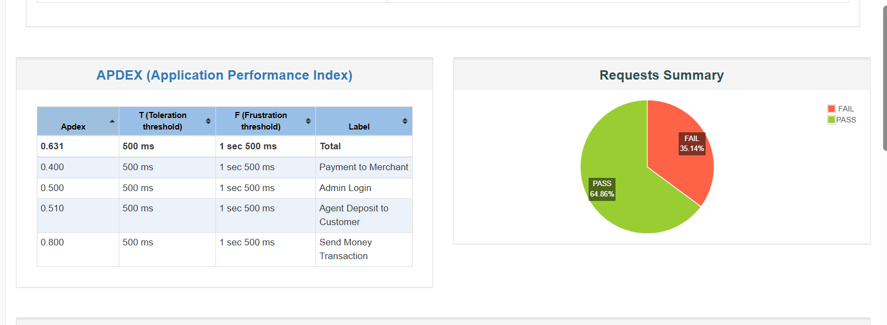
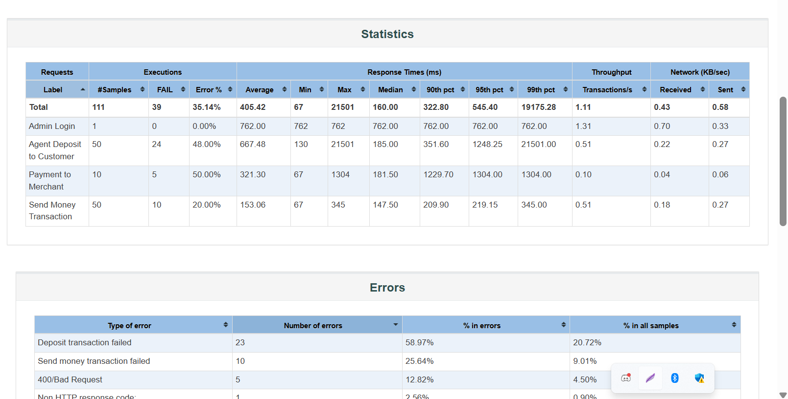

# Dmoney API JMeter Test Plan

## Assignment Details
- **Batch No:** 16
- **Topic:** JMeter Chaining
- **API:** Dmoney Transaction API

## Project Description
This JMeter test plan simulates a realistic transaction flow in the Dmoney payment system with the following scenarios:
- 5 agents perform deposits for 10 customers
- 5 customers send money to another 10 customers
- 5 customers make payments to 2 merchants

## Project Structure
```
dmoney-jmeter/
│
├── dmoney.jmx                 # Main JMeter test plan
├── Resources/                  # CSV data files
│   ├── deposit.csv            # Agent-Customer deposit data
│   ├── sendMoney.csv          # Customer-Customer transfer data
│   └── payment.csv            # Customer-Merchant payment data
├── dmoney_results.csv         # Test results (generated after run)
└── README.md                  # Project documentation
```

## Prerequisites
- JMeter 5.5 or higher
- Java 8 or higher
- Dmoney API running on `https://dmoney.roadtocareer.net`
- Admin credentials: `admin@roadtocareer.net` / `1234`

## Test Configuration

### Thread Groups
1. **Setup Thread Group - Admin Login**
   - Threads: 1
   - Executes once to generate authentication token

2. **Thread Group - Agent Deposits**
   - Threads: 5 agents
   - Loops: 10 (for 10 customers)
   - Ramp-up: 120 seconds
   - Random amount: 100-500 tk

3. **Thread Group - Send Money**
   - Threads: 5 customers
   - Loops: 10 (to 10 receivers)
   - Ramp-up: 120 seconds
   - Random amount: 50-200 tk

4. **Thread Group - Payments**
   - Threads: 5 customers
   - Loops: 2 (to 2 merchants)
   - Ramp-up: 120 seconds
   - Random amount: 30-150 tk

### CSV Data Configuration

#### deposit.csv
Contains agent and customer phone numbers for deposit transactions:
- 5 unique agent phone numbers
- 10 unique customer phone numbers
- Each agent deposits to multiple customers

#### sendMoney.csv
Contains sender and receiver customer phone numbers:
- 5 sender customer phone numbers
- 10 receiver customer phone numbers
- Each sender transfers to multiple receivers

#### payment.csv
Contains customer and merchant phone numbers:
- 5 customer phone numbers
- 2 merchant phone numbers
- Each customer makes payments to merchants

## How to Run

1. **Clone the repository:**
```bash
git clone
cd dmoney-jmeter
```

2. **Ensure CSV files are in Resources folder:**
```bash
mkdir Resources
# Place deposit.csv, sendMoney.csv, and payment.csv in Resources folder
```

3. **Open JMeter:**
```bash
jmeter
```

4. **Load the test plan:**
   - File → Open → Select `dmoney.jmx`

5. **Configure if needed:**
   - Update BASE_URL if API is not on localhost:3000
   - Verify CSV file paths are correct

6. **Run the test:**
   - Click the green Start button
   - Monitor results in View Results Tree and Summary Report

7. **Generate HTML Report:**
```bash
jmeter -n -t dmoney.jmx -l dmoney_results.csv -e -o html_report/
```

## Assertions
All transactions include the following assertions to ensure success:
- **Response Code Assertion:** Expects 201 for successful transactions
- **JSON Assertion:** Validates response message content
- Admin login expects 200 response code

## Test Results

### Summary Report

*Summary Report showing test execution results*


### Request Statistics

*[Add screenshot of HTML report statistics after running tests]*

### Transaction Flow
1. **Admin Login** → Generates authentication token
2. **Agent Deposits** → Agents fund customer accounts
3. **Send Money** → Customers transfer money between accounts
4. **Payments** → Customers pay merchants for services

## Key Features
- ✅ Dynamic token management using Setup Thread Group
- ✅ CSV-driven test data for scalability
- ✅ Random amount generation for realistic scenarios
- ✅ Proper ramp-up time (120 seconds) for load distribution
- ✅ Comprehensive assertions for transaction validation
- ✅ Reusable CSV data with recycling enabled
- ✅ Small transaction amounts to prevent balance depletion

## Notes
- All phone numbers in CSV files should be valid Bangladesh mobile numbers (11 digits starting with 01)
- Ensure sufficient balance in agent accounts before running tests
- Transaction amounts are kept small to avoid insufficient balance errors
- The test plan uses property function to share admin token across thread groups

## Troubleshooting

### Common Issues
1. **Authentication Failed**
   - Verify admin credentials in Setup Thread Group
   - Check if API server is running

2. **Insufficient Balance**
   - Reduce random amount ranges
   - Ensure agents have sufficient initial balance

3. **CSV File Not Found**
   - Verify CSV files are in Resources folder
   - Check file paths in CSV Data Set Config

4. **Connection Refused**
   - Verify API is running on configured BASE_URL
   - Check firewall settings

## Author
[Your Name]
Batch 16 - Road to SDET

## License
This project is created for educational purposes as part of the JMeter assignment.